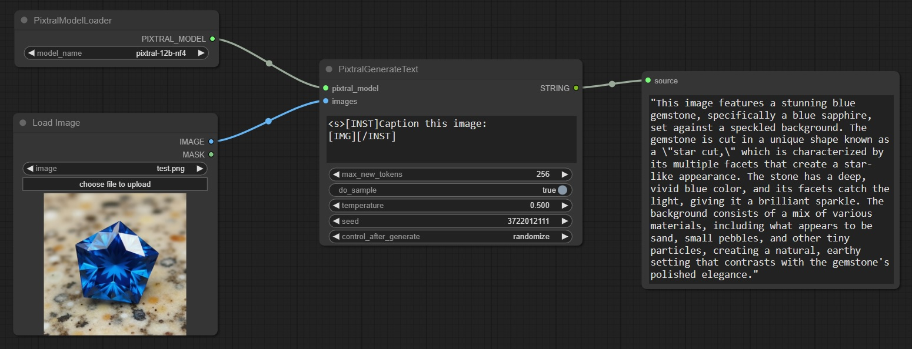

# ComfyUI-Pixtral
 For loading and running Pixtral models

Includes two nodes, PixtralModelLoader and PixtralGenerateText. These should be self-explanatory.
 
Install the latest version of transformers, which has support for Pixtral models:
`python_embeded\python.exe -m pip install git+https://github.com/huggingface/transformers`
Requires transformers 4.45.0

Also install bitsandbytes if you don't have it already:
`python_embeded\python.exe -m pip install bitsandbytes`

