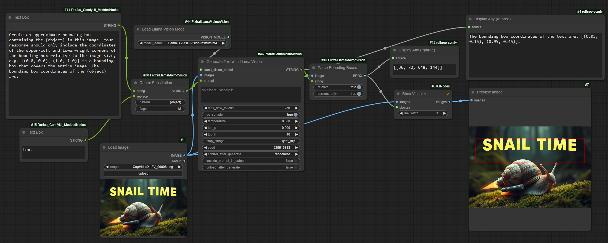

# ComfyUI-PixtralLlamaVision

For loading and running Pixtral, Llama 3.2 Vision, and Molmo models. 

Important change compared to last version: Models should now be placed in the `ComfyUI/models/LLM` folder for better compatibility with other custom nodes for LLM. I apologize for having to move your models around if you were using the previous version.

Includes nodes for loading and running VLMs:
- Load Vision Model
- Load Pixtral Model
- Load Llama Vision Model
- Load Molmo Model
- Generate Text with Pixtral
- Generate Text with Llama Vision
- Generate Text with Molmo

Along with some utility nodes for working with text:
- Parse Bounding Boxes
- Parse Points
- Plot Points
- Regex Split String
- Regex Search
- Regex Find All
- Regex Substitution
- Join String
- Select Index
- Slice List

The Load Vision Model node is able to load any of these model types, but it will also be able to load other models in the LLM folder. Other model types, like Florence2, will not work with these nodes, though.

The other model loading nodes are for specific model types and will filter the list to just that model type.

The text generation nodes are model-specific. Pixtral seems to be the only one out of these that currently supports repetition penalty. The prompts used in these nodes are raw, and need to include the special tokens to create an instruction or chat template. I plan to add some more nodes for creating prompts following a template like this, though.

Use `trust_remote_code` at your own risk. (I think Molmo looks safe, though)

I will probably rename this repo (again) pretty soon, considering it's expanded beyond just being for Pixtral.

## Installation

Available in [ComfyUI-Manager](https://github.com/ltdrdata/ComfyUI-Manager) as ComfyUI-PixtralLlamaVision. When installed from ComfyUI-Manager, the required packages will be installed automatically. You may need to update your pytorch version.

If you install by cloning this repo into your custom nodes folder, you'll need to install `transformers >= 4.45.0` to load Pixtral and Llama Vision models, and you'll also need to make sure `accelerate`, `bitsandbytes`, and `torchvision` are updated. You can install these in the windows portable version of ComfyUI with:
`python_embeded\python.exe -m pip install -r ComfyUI\custom_nodes\ComfyUI-PixtralLlamaVision\requirements.txt`

Models should be placed in the `ComfyUI/models/LLM` folder, with each model inside a folder with the `model.safetensors` file along with any config files and the tokenizer.

You can get a 4-bit quantized version of Pixtral-12B and/or Llama-3.2-11B-Vision-Instruct which is compatible with these custom nodes here:

[https://huggingface.co/SeanScripts/pixtral-12b-nf4](https://huggingface.co/SeanScripts/pixtral-12b-nf4)

[https://huggingface.co/SeanScripts/Llama-3.2-11B-Vision-Instruct-nf4](https://huggingface.co/SeanScripts/Llama-3.2-11B-Vision-Instruct-nf4)

Unfortunately, the Pixtral nf4 model has considerably degraded performance on some tasks, like OCR. The Llama Vision model seems to be better for this task.

## Examples

Example Pixtral image captioning (not saving the output to a text file in this example):

Both models should work very well for image captioning, even in 4-bit quantization. You can also customize your captioning instructions.

Example Pixtral image comparison:

I haven't been able to get image comparison to work well at all with Llama Vision. It doesn't give any errors, but the multi-image understanding just isn't there. The image tokens have to be **before** the question/instruction and consecutive for the model to even be able to see both images at once (I found this out by looking at the image preprocessor cross-attention implementation), and even then, it seems to randomly mix up which is the first/second, left/right, the colors between them and other details. It doesn't seem usable for purposes involving two images in the same message, in my opinion. Not sure whether the non-quantized model is better at this.

Since Pixtral directly tokenizes the input images, it's able to handle them inline in the context, with any number of images of any aspect ratio, but it's limited by token lengths, since each image can be around 1000 tokens.

Example Llama Vision object detection with bounding box:

Both models kind of work for this, but not that well. They definitely have some understanding of the positions of objects in the image, though. Maybe it needs a better prompt. Or a non-quantized model. Or a finetune. But it does sometimes work.

Example Molmo counting:

Example Molmo pointing, with labels:

I wasn't able to get it to point at both objects with a single prompt for some reason (it would just assign both labels to both points), but splitting it into two simple prompts like this isn't too bad.